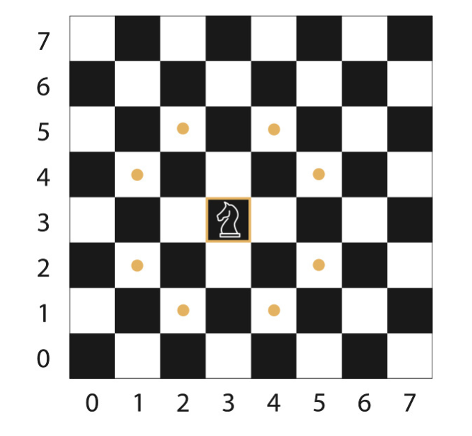

# Odin_Knight-Travails
Odin Project's Knight Travails project. Creating a grid-based 'chessboard' for a knight piece to traverse.

## Assignment
Your task is to build a function knightMoves that shows the shortest possible way to get from one square to another by outputting all squares the knight will stop on along the way.

Given enough turns, a knight on a standard 8x8 chess board can move from any square to any other square. Its basic move is two steps forward and one step to the side or one step forward and two steps to the side. It can face any direction.

All the possible places you can end up after one move look like this:

You can think of the board as having 2-dimensional coordinates. Calling your function would therefore look like:

```JS
knightMoves([0,0],[1,2]) // returns [[0,0],[1,2]]
```
-----------------------------
ℹ️ Multiple shortest paths:
Sometimes there is more than one fastest path. Examples of this are shown below. Any answer is correct as long as it follows the rules and gives the shortest possible path.
```JS
    knightMoves([0,0],[3,3]) may return [[0,0],[2,1],[3,3]] or [[0,0],[1,2],[3,3]].
    knightMoves([3,3],[0,0]) may return [[3,3],[2,1],[0,0]] or [[3,3],[1,2],[0,0]].
    knightMoves([0,0],[7,7]) may return [[0,0],[2,1],[4,2],[6,3],[4,4],[6,5],[7,7]] or [[0,0],[2,1],[4,2],[6,3],[7,5],[5,6],[7,7]] or other possible shortest paths.
```
-----------------------------
    1. Think about the rules of the board and knight, and make sure to follow them.
    2. From every square, multiple moves are possible. Choose a data structure that will allow you to work with them. Don’t allow any moves to go off the board.
    3. Decide which search algorithm is best to use for this case. Hint: one of them could be a potentially infinite series.
    4. Use the chosen search algorithm to find the shortest path between the starting square (or node) and the ending square. Output what that full path looks like, e.g.:
```JS
  > knightMoves([3,3],[4,3])
  => You made it in 3 moves!  Here's your path:
    [3,3]
    [4,5]
    [2,4]
    [4,3]
```